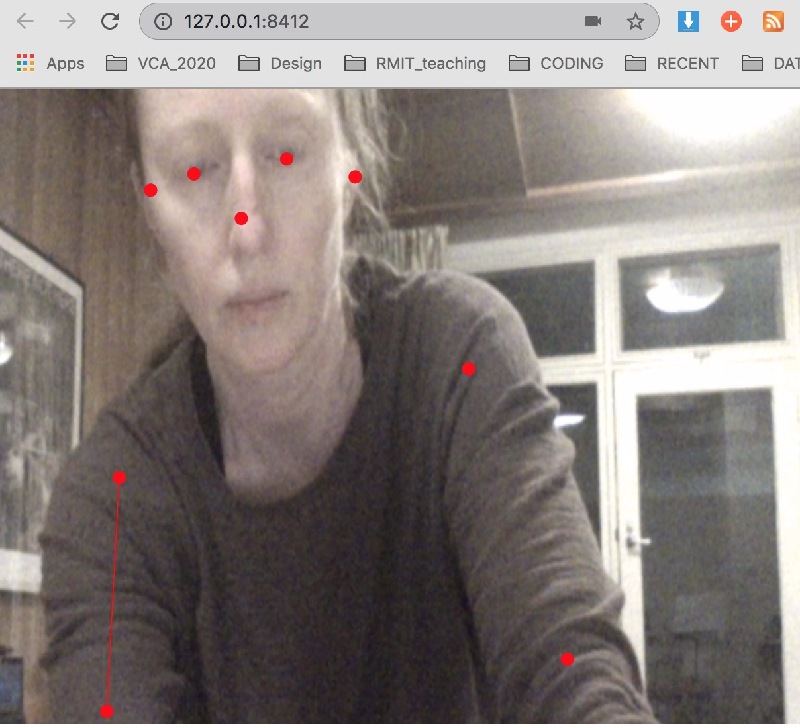
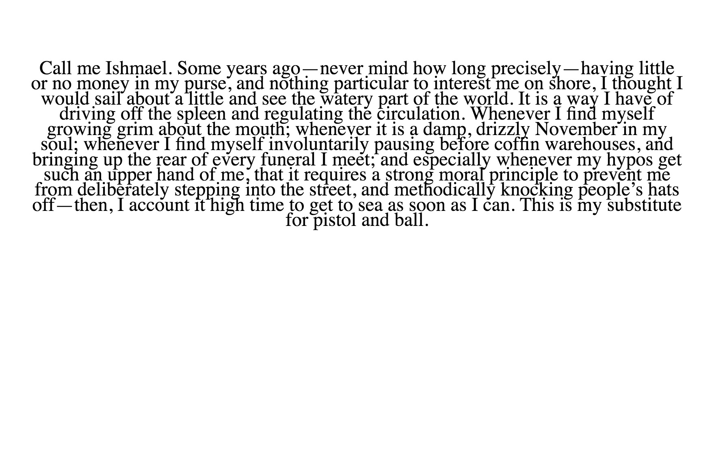
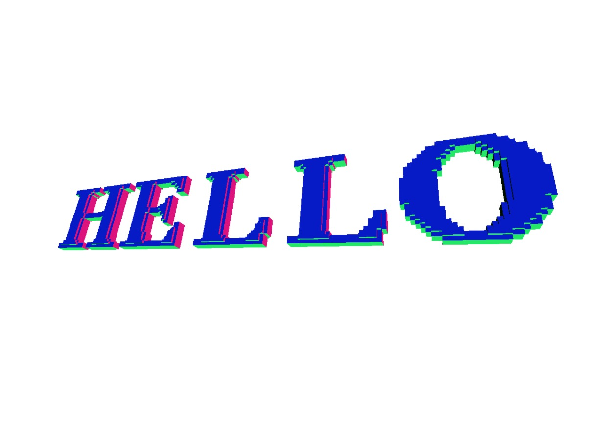

# Some examples in p5js with links to sketch 'in action'
In&nbsp;action&nbsp;&nbsp;&nbsp;&nbsp;&nbsp;&nbsp; | Description | [P5 js Library](https://p5js.org/libraries/) | Possible use / demo | Example Sketch/folder 
----------------- | ------------- | ------------- | ------------- | ------------- 
<a href= "https://karenanndonnachie.github.io/Slave-To-The-Algorithm/P5js/poseNet_test" target="_blank"><a/> | Motion / Pose | poseNet  | Motion Tracking | <a href="poseNet_test/" target="_blank">poseNet/</a>
 | Sound In / Out / Volume etc | [P5.sound.js](https://p5js.org/reference/#/libraries/p5.sound) | Play music / analyse sound | <a href="P5js_soundTest/" target="_blank">soundTest/</a>
 | Paragraph text | [P5 js](https://p5js.org/reference/) | Import text / animate as wave | <a href="TextParaMobyDick/" target="_blank">TextParaMobyDick/</a>
<a href= "https://karenanndonnachie.github.io/Slave-To-The-Algorithm/P5js/CODEWORDS13aug/"> | Import Fonts & Animate text | [P5 js](https://p5js.org/reference/)  | Translate/Rotate animate / map() function | <a href="spinnyText/" target="_blank">spinnyText/</a>
 | Lots of wiggly letters all over... | [P5 js](https://p5js.org/reference/) + [custom Class](https://p5js.org/reference/#/p5/class) | Fill Window with text, erase with mouse | <a href="randomLettersErase/" target="_blank">randomLettersErase/</a>
 | Draw with Vectors & count points | [P5 js](https://p5js.org/reference/) + [custom Class](https://p5js.org/reference/#/p5/class) | Drawing app that tracks "complexity" | <a href="doodleVector_p5js/" target="_blank">doodleVector_p5js/</a>
 | Speech to Text from microphone | [P5 Speech library](https://idmnyu.github.io/p5.js-speech/) | Uses microphone as input, writes text to screen. Can also do the inverse (ie. read a text) | <a href="p5Speech_singleLineContinuous/" target="_blank">p5Speech_singleLineContinuous/</a>
<a href="https://github.com/FreddieRa/p5.3D/wiki/Word3D" target="_blank"> | 3D TEXT with WEBGL P5js | [Github Repo](https://github.com/FreddieRa/p5.3D/wiki/Word3D) | Can make words, shapes and more in 3D with WEBGL | no demo 
<a href="https://simandy.github.io/codewords"> | p5js textToPoints() function | [textToPoints()](https://p5js.org/reference/#/p5.Font/textToPoints) | Uses loaded font geometry to create points | https://simandy.github.io/codewords
