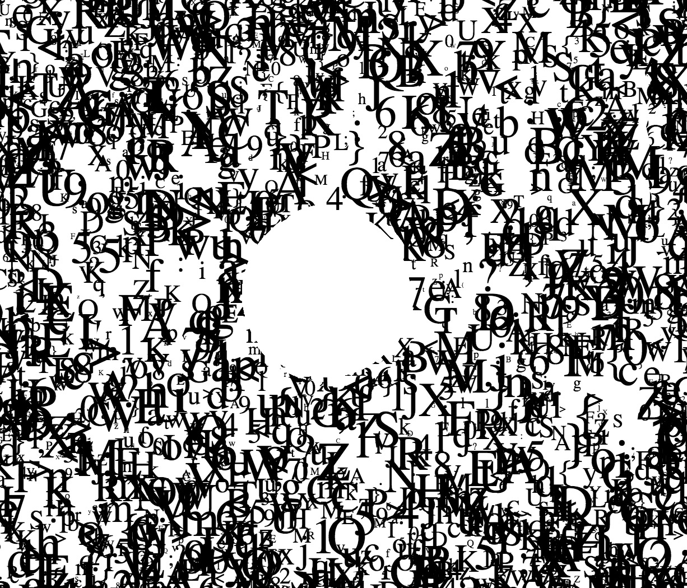

# Processing & P5js & P5.play
This is where we will keep all our sketches from the tutorials

# P5js is Processing for Web : P5js helper codes
### Tutorial transition from Processing to P5js https://github.com/processing/p5.js/wiki/Processing-transition
 
In&nbsp;action&nbsp;&nbsp;&nbsp;&nbsp;&nbsp;&nbsp; | Description | [P5 js Library](https://p5js.org/libraries/) | Possible use / demo | Example Sketch/folder 
----------------- | ------------- | ------------- | ------------- | ------------- 
<a href= "https://karenanndonnachie.github.io/Slave-To-The-Algorithm/P5js/poseNet_test" target="_blank"><a/> | Motion / Pose | poseNet  | Motion Tracking | <a href="poseNet_test/" target="_blank">poseNet/</a>
 | Sound In / Out / Volume etc | [P5.sound.js](https://p5js.org/reference/#/libraries/p5.sound) | Play music / analyse sound | <a href="P5js_soundTest/" target="_blank">soundTest/</a>
 | Paragraph text | [P5 js](https://p5js.org/reference/) | Import text / animate as wave | <a href="TextParaMobyDick/" target="_blank">TextParaMobyDick/</a>
<a href= "https://karenanndonnachie.github.io/Slave-To-The-Algorithm/P5js/CODEWORDS13aug/"> | Import Fonts & Animate text | [P5 js](https://p5js.org/reference/)  | Translate/Rotate animate / map() function | <a href="spinnyText/" target="_blank">spinnyText/</a>
 | Lots of wiggly letters all over... | [P5 js](https://p5js.org/reference/) + [custom Class](https://p5js.org/reference/#/p5/class) | Fill Window with text, erase with mouse | <a href="randomLettersErase/" target="_blank">randomLettersErase/</a>
 | Draw with Vectors & count points | [P5 js](https://p5js.org/reference/) + [custom Class](https://p5js.org/reference/#/p5/class) | Drawing app that tracks "complexity" | <a href="doodleVector_p5js/" target="_blank">doodleVector_p5js/</a>
 | Speech to Text from microphone | [P5 Speech library](https://idmnyu.github.io/p5.js-speech/) | Uses microphone as input, writes text to screen. Can also do the inverse (ie. read a text) | <a href="p5Speech_singleLineContinuous/" target="_blank">p5Speech_singleLineContinuous/</a>
<a href="https://github.com/FreddieRa/p5.3D/wiki/Word3D" target="_blank"> | 3D TEXT with WEBGL P5js | [Github Repo](https://github.com/FreddieRa/p5.3D/wiki/Word3D) | Can make words, shapes and more in 3D with WEBGL | no demo 
## Mouse Events
Working with mouse events using p5js is easy. We can create sketches that do various things based on the mouse's position on the screen or when the mouse button is pressed, 
etc. Here is a list of the mouse related functions in p5js:
<ul> 
	<li><a href="http://p5js.org/reference/#/p5/mouseX">mouseX</a></li>
	<li><a href="http://p5js.org/reference/#/p5/mouseY">mouseY</a></li>
	<li><a href="http://p5js.org/reference/#/p5/pmouseX">pmouseX</a></li>
	<li><a href="http://p5js.org/reference/#/p5/pmouseY">pmouseY</a></li>
	<li><a href="http://p5js.org/reference/#/p5/winMouseX">winMouseX</a></li>
	<li><a href="http://p5js.org/reference/#/p5/winMouseY">winMouseY</a></li>
	<li><a href="http://p5js.org/reference/#/p5/pwinMouseX">pwinMouseX</a></li>
	<li><a href="http://p5js.org/reference/#/p5/pwinMouseY">pwinMouseY</a></li>
	<li><a href="http://p5js.org/reference/#/p5/mouseButton">mouseButton</a></li>
	<li><a href="http://p5js.org/reference/#/p5/mouseIsPressed">mouseIsPressed</a></li>
	<li><a href="http://p5js.org/reference/#/p5/mouseMoved">mouseMoved()</a></li>
	<li><a href="http://p5js.org/reference/#/p5/mouseDragged">mouseDragged()</a></li>
	<li><a href="http://p5js.org/reference/#/p5/mousePressed">mousePressed()</a></li>
	<li><a href="http://p5js.org/reference/#/p5/mouseReleased">mouseReleased()</a></li>
	<li><a href="http://p5js.org/reference/#/p5/mouseClicked">mouseClicked()</a></li>
	<li><a href="http://p5js.org/reference/#/p5/mouseWheel">mouseWheel()</a></li>
</ul>

## Touch events
<ul>
	<li><a href="http://p5js.org/reference/#/p5/touchX">touchX</a></li>
	<li><a href="http://p5js.org/reference/#/p5/touchY">touchY</a></li>
    <li><a href="http://p5js.org/reference/#/p5/touches[]">touches[]</a></li>
    <li><a href="http://p5js.org/reference/#/p5/touchStarted">touchStarted()</a></li>
    <li><a href="http://p5js.org/reference/#/p5/touchMoved">touchMoved()</a></li>
    <li><a href="http://p5js.org/reference/#/p5/touchEnded">touchEnded()</a></li>
</ul>

## Example of Keyboard functions
<pre>function keyPressed()
{
  // UP key
  if(keyCode == UP_ARROW)
  {
    ypos = ypos - numPixels; 
  }
 
  // DOWN key
  if(keyCode == DOWN_ARROW)
  { 
    ypos = ypos + numPixels; 
  }
 
  // RIGHT key
  if(keyCode == RIGHT_ARROW)
  {
    xpos = xpos + numPixels; 
  }
 
  // LEFT key
  if(keyCode == LEFT_ARROW)
  {
    xpos = xpos - numPixels; 
  }
}
</pre>

## P5.play :  a library for p5.js for animation, gaming and using sprites
Paolo Pedercini's p5.play Library: http://molleindustria.github.io/p5.play/
Allison Parrish explains it all : https://creative-coding.decontextualize.com/making-games-with-p5-play/
